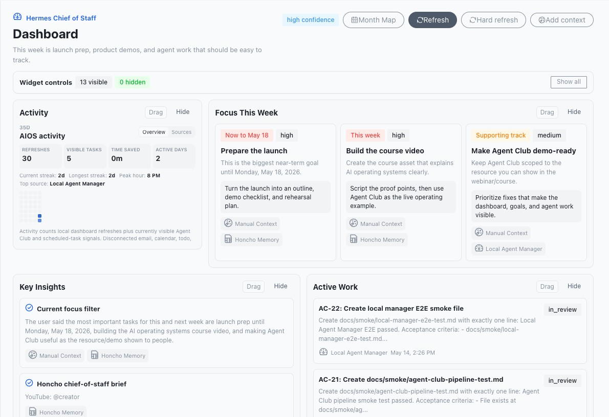
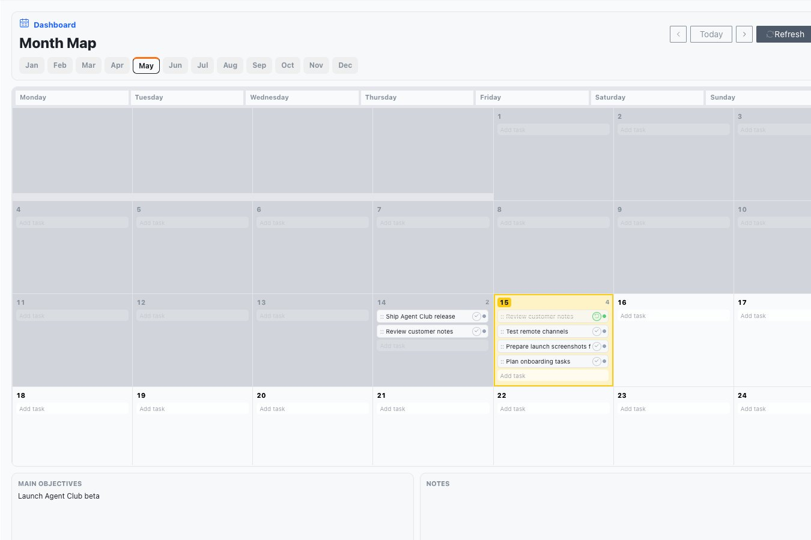
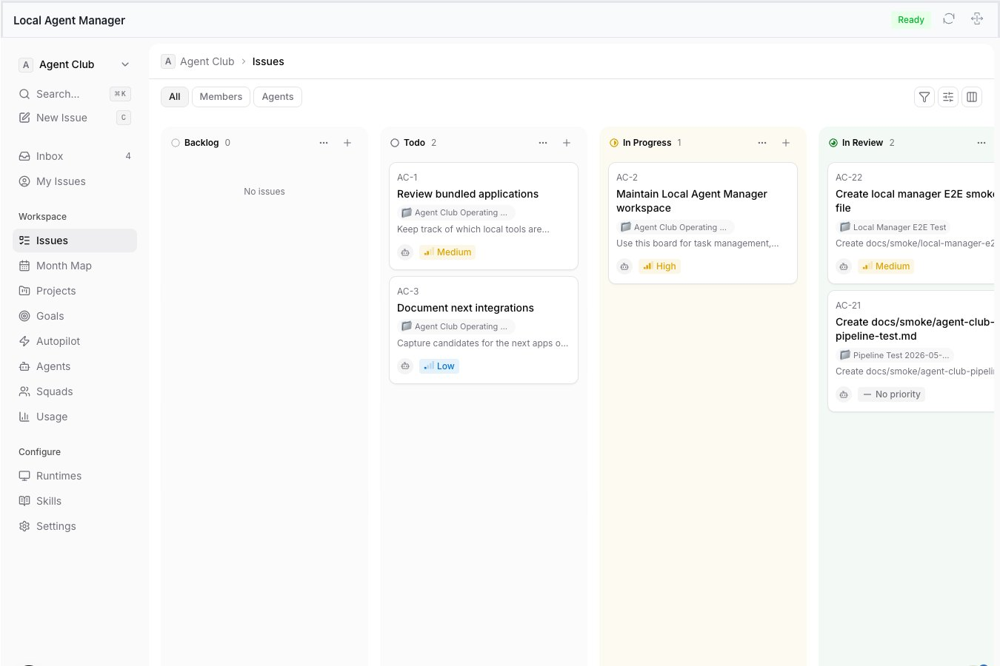
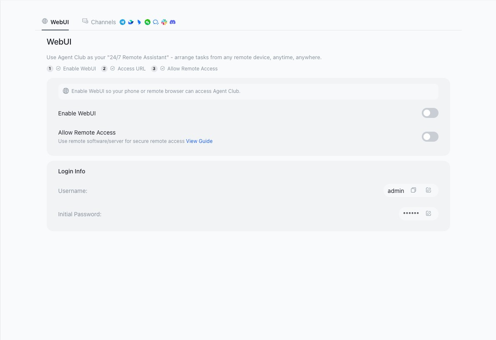
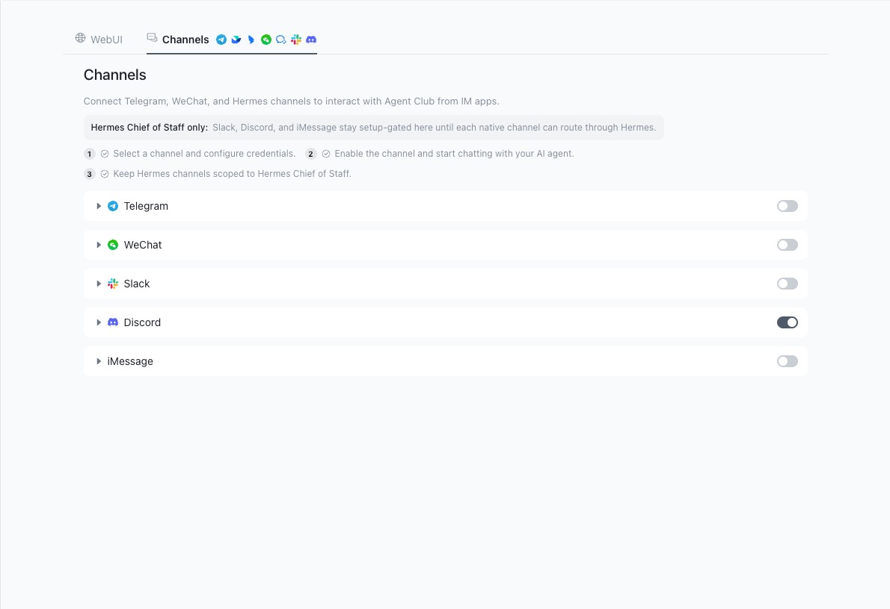
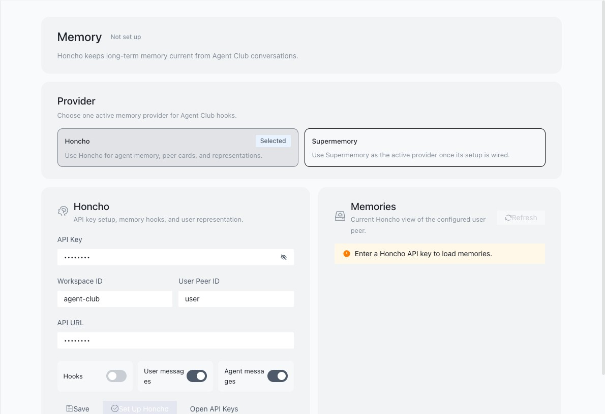
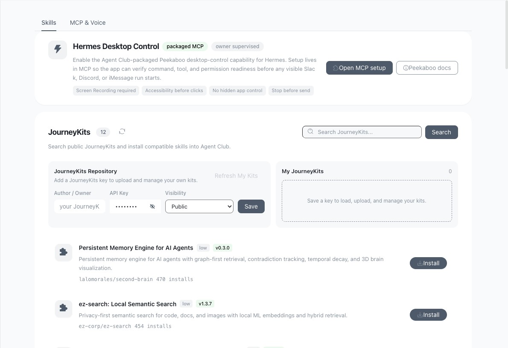
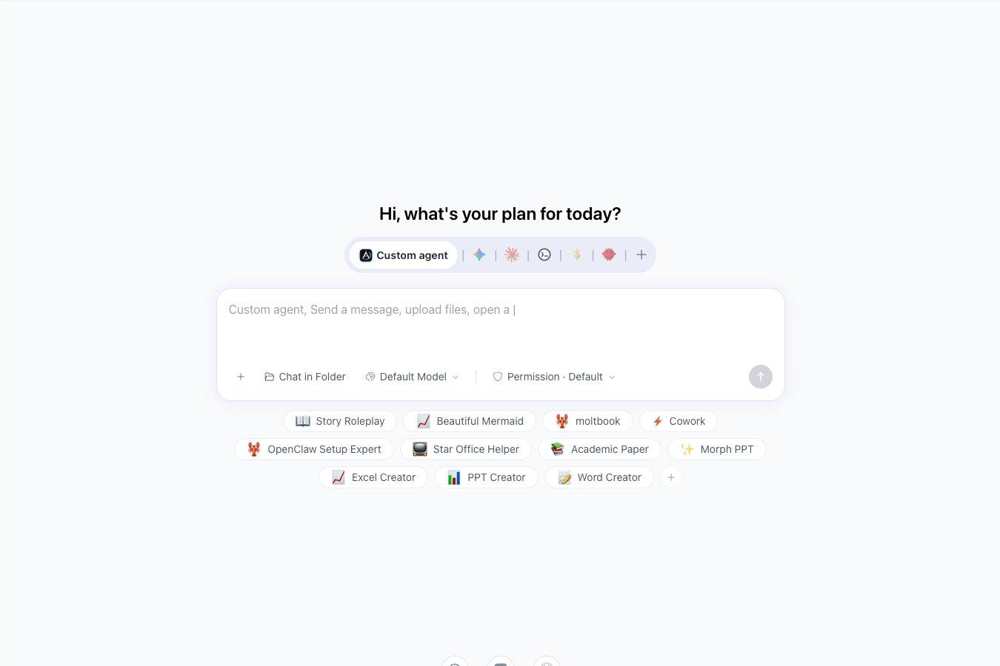
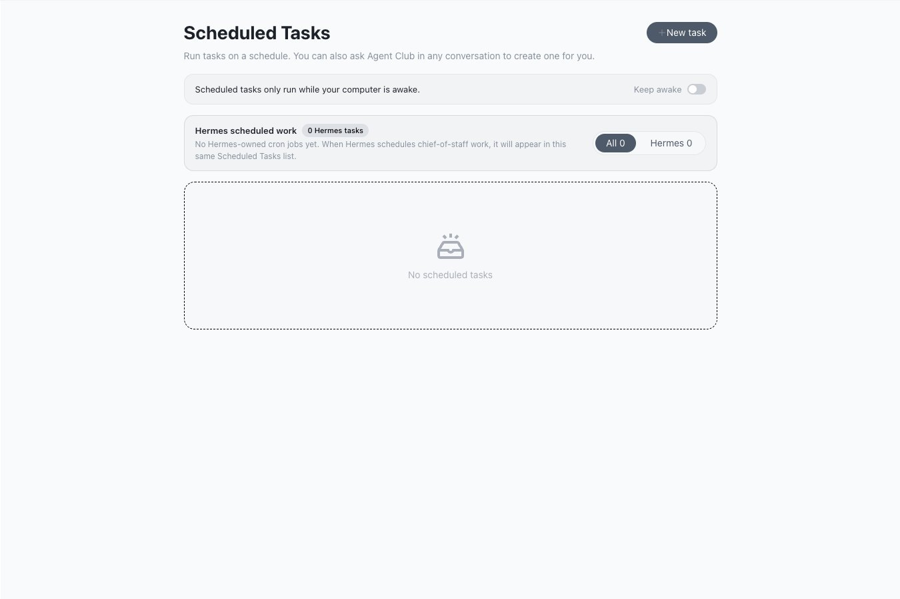
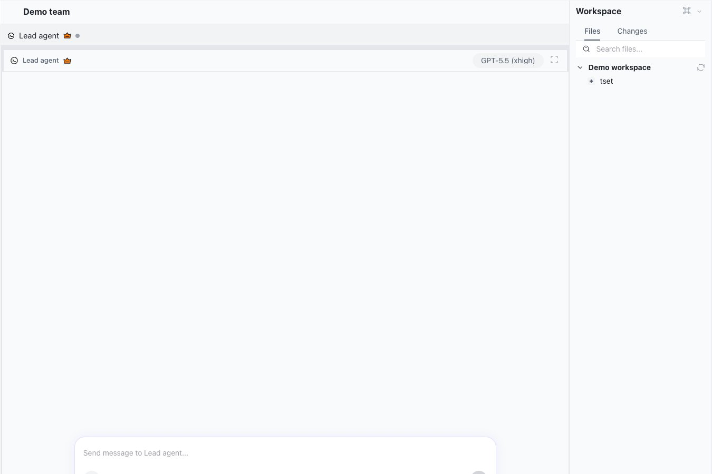

# Agent Club

<p>
  <a href="https://github.com/AI-Answer/Agent-Club/releases/latest">
    
  </a>
</p>

Download the latest Mac release, open the DMG, and drag `AgentClub.app` into Applications.

Agent Club is a desktop workspace for managing an AI workforce.

It brings chat, local agents, tasks, goals, schedules, channels, memory, skills, and a personal planner into one app so you can see what every agent is doing, where work is stuck, what matters today, and which channels are connected.

## Your AI Workforce Control Center

Agent work gets fragmented fast. One assistant is in a browser chat, another is running in a terminal, a third is connected to Discord or Slack, and the actual priorities live somewhere else entirely.

Agent Club is built to make that manageable. The Dashboard is the first place to check the whole system: current focus, active work, scheduled signals, memory context, channels, and quick actions. It is still early, but the direction is clear: one chief-of-staff surface for the AI workforce you are building.



Use Agent Club when you want to manage agents like a team:

- Chat with different AI agents from one desktop app
- Create goals, projects, and tasks that agents can work on
- Track running work, completed work, and stuck work
- Plan your month and daily priorities visually
- See work across local agents, remote agents, schedules, and messaging channels
- Connect tools, skills, MCP servers, and local capabilities
- Run scheduled or recurring agent workflows
- Keep agent work tied to the files, prompts, and context that matter

## Why It Is Useful

Most agent workflows break down because the work is scattered. Tasks live in chat threads, project context lives in notes, progress lives in logs, and remote channels become their own little islands.

Agent Club gives your AI workforce a shared operating layer:

- **One command center**: start chats, goals, tasks, and scheduled work from the same app.
- **One visibility layer**: see priorities, running work, agent activity, and work that needs review.
- **One planner for priorities**: use the Month Map to show agents what matters today and what is coming later.
- **One channel hub**: connect WebUI and messaging surfaces so work can come from the places you already use.
- **One context layer**: planner entries, goals, tasks, memory, and skills can become context that agents use while working.
- **Less fragmentation**: fewer disconnected chats, terminals, spreadsheets, and forgotten task lists.
- **Simple installation**: download the app, drag it into Applications, and start using it.

## Plan The Month

The Month Map is a Google-Sheets-style planner for your current month. You can write tasks directly into days, drag tasks from one day to another, mark work done, highlight days with colors, and keep notes and main objectives under the calendar.

The important part is that this is not just a pretty calendar. It is planning context your agents can read and update, so "my top three today are..." can become actual planner entries instead of disappearing into a chat thread.



## Track Agent Work

The Local Agent Manager is where projects, goals, issues, and agent runs become visible. This is the board view for work that should not stay trapped inside a terminal session.

When you turn a task into agent work, the board gives you a place to see what exists, what is active, what needs review, and what is already done.



## Reach It From Anywhere

Channels and WebUI are the bridge out of the desktop. Run Agent Club on one host machine, enable the WebUI, and a browser on another computer can become a control surface for the same workspace.



Channels are where supported messaging routes live. Telegram, WeChat, Slack, Discord, iMessage, and Hermes-style routes can be configured or setup-gated from one place, so agent work can eventually be started and monitored from the surfaces you already use.



## Give Agents Memory

Memory is where Agent Club connects long-term context to agent work. The current memory surface is built around Honcho, with room for other providers as the app grows.

The goal is simple: agents should not have to rediscover who you are, what matters, or what context they should carry between conversations.



## Add Skills And Tools

Skills turn repeated workflows into reusable instructions and capabilities. The Skills and MCP setup area is where Agent Club can package local desktop control, install JourneyKits, and connect extra tools agents can use.

This is how the app becomes more than chat: you can keep adding new abilities without rebuilding the whole workflow from scratch.



## Chat, Schedule, And Work In Teams

The chat workspace is the everyday entry point. Start a conversation, pick an agent, attach files, select models, and use assistant presets from one home screen.



Scheduled Tasks keep recurring agent work visible. This is where regular check-ins, future runs, and recurring workflows can live.



Teams let multiple agents work in the same space with shared files and per-agent chat lanes.



## Install Agent Club

The easiest way to install Agent Club on a Mac is from the latest GitHub release:

https://github.com/AI-Answer/Agent-Club/releases/latest

For Apple Silicon Macs, download the latest file ending in `mac-arm64.dmg`, open it, and drag `AgentClub.app` into your Applications folder.

Right now the published desktop installer is for Apple Silicon Macs. Intel Mac, Windows, and Linux builds can be added from the same packaging setup once release signing and CI are configured for those platforms.

### Copy-Paste Install Prompt

If you use Codex, ChatGPT, Claude Code, or another assistant that can access your local terminal, paste this prompt and let it do the setup for you:

```text
Install Agent Club on this Mac from GitHub.

Release page:
https://github.com/AI-Answer/Agent-Club/releases/latest

Please do the full install for me:
1. Check the Mac architecture with `uname -m`.
2. If this is an Apple Silicon Mac (`arm64`), download the newest release asset ending in `mac-arm64.dmg`.
3. Mount the DMG.
4. Quit Agent Club if it is already running.
5. Copy `AgentClub.app` into `/Applications`, replacing an older copy if one exists.
6. Detach the DMG.
7. Open `/Applications/AgentClub.app`.
8. If macOS blocks the app because it is not notarized yet, do not bypass security silently. Show me the exact right-click Open or System Settings > Privacy & Security step I need to approve.
9. Tell me the installed app path, the release version, and whether the app opened successfully.

Use terminal commands where possible instead of making me do manual steps.
```

### Manual Mac Install

1. Open the latest release page:
   https://github.com/AI-Answer/Agent-Club/releases/latest
2. Download `Agent-Club-*-mac-arm64.dmg`.
3. Open the DMG.
4. Drag `AgentClub.app` into Applications.
5. Open Agent Club from Applications.

If macOS says the app is from an unidentified developer, right-click `AgentClub.app`, choose Open, then approve the prompt. This happens because local releases are currently ad-hoc signed and not notarized with an Apple Developer ID yet.

## Community

For support, discussion, and updates, join Claude Club:

https://www.skool.com/claude

## Developer Setup

Use this path if you want to run the app from source instead of installing the DMG.

Install dependencies:

```bash
bun install
```

Start the desktop app in development mode:

```bash
bun run start
```

Run targeted lint checks:

```bash
bun run lint
```

Build the renderer web bundle:

```bash
bun run build:renderer:web
```

Build a local macOS DMG and ZIP:

```bash
bun run dist:mac
```

## Project Structure

- `src/renderer/` - desktop UI, routes, settings, and pages
- `src/process/` - main-process services, agents, channels, and background work
- `src/common/` - shared config, types, and IPC contracts
- `src/preload/` - bridge code between the renderer and main process
- `apps/agent-manager/` - embedded Local Agent Manager / Multica workspace
- `resources/` - packaged icons, images, and app resources
- `docs/` - product notes, implementation plans, and architecture references

## Verification

Useful checks while developing:

```bash
bun run lint
bun run build:renderer:web
node scripts/check-i18n.js
```
